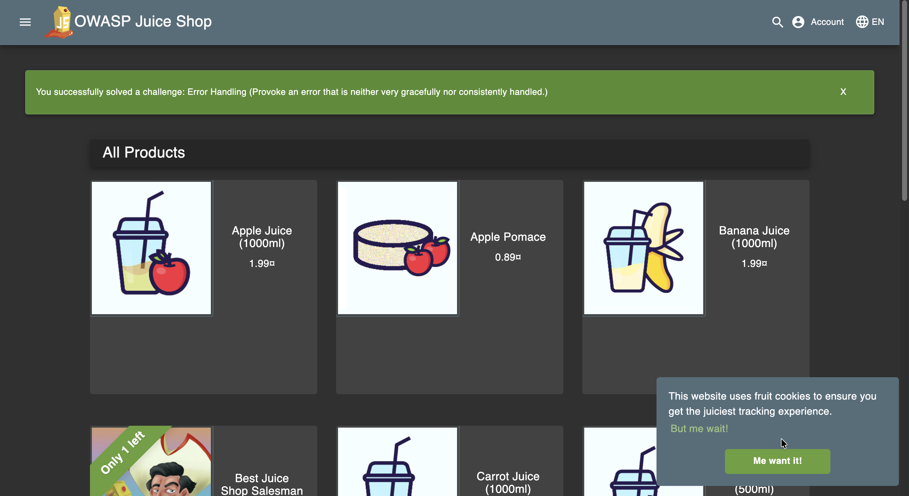
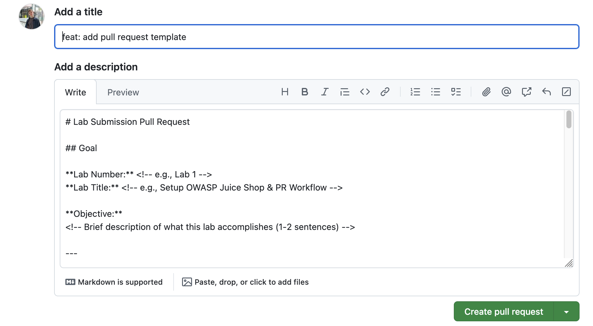

# Lab 1 Submission — OWASP Juice Shop Setup & PR Workflow

**Student:** Ilsaf Abdulkhakov  
**Date:** Feb 8, 2026  
**Lab:** Lab 1 — Setup OWASP Juice Shop & PR Workflow

---

## Task 1 — OWASP Juice Shop Deployment & Triage Report

### Triage Report — OWASP Juice Shop

#### Scope & Asset
- **Asset:** OWASP Juice Shop (local lab instance)
- **Image:** `bkimminich/juice-shop:v19.0.0`
- **Release link/date:** [v19.0.0](https://github.com/juice-shop/juice-shop/releases/tag/v19.0.0) — Sep 4, 2025
- **Image digest:** `sha256:2765a26de7647609099a338d5b7f61085d95903c8703bb70f03fcc4b12f0818d`

#### Environment
- **Host OS:** macOS 26.2
- **Docker:** 28.0.4

#### Deployment Details
- **Run command used:** `docker run -d --name juice-shop -p 127.0.0.1:3000:3000 bkimminich/juice-shop:v19.0.0`
- **Access URL:** http://127.0.0.1:3000
- **Network exposure:** 127.0.0.1 only [x] Yes  [ ] No

#### Health Check
- **Page load:**
  

- **API check:**
  ```json
  <html>
    <head>
      <meta charset='utf-8'> 
      <title>Error: Unexpected path: /rest/products</title>
  ```
  *(Note: The API returned an HTML error for `/rest/products`, but the application UI loads correctly)*

#### Surface Snapshot (Triage)
- **Login/Registration visible:** [x] Yes  [ ] No — notes: Accessible via navigation bar.
- **Product listing/search present:** [x] Yes  [ ] No — notes: Catalog visible, search functional.
- **Admin or account area discoverable:** [x] Yes  [ ] No — notes: Account creation open, admin paths discoverable.
- **Client-side errors in console:** [ ] Yes  [x] No — notes: No critical errors during triage.
- **Security headers:** `curl -I http://127.0.0.1:3000`
  - CSP: Missing
  - HSTS: Missing
  - X-Frame-Options: SAMEORIGIN
  - X-Content-Type-Options: nosniff

#### Risks Observed (Top 3)
1. **Missing Content Security Policy (CSP):** Lack of CSP headers increases the risk of Cross-Site Scripting (XSS) attacks.
2. **Missing HTTP Strict Transport Security (HSTS):** Absence of HSTS allows for potential MITM and protocol downgrade attacks.
3. **Information Exposure (X-Recruiting):** The `X-Recruiting` header exposes internal paths (/#/jobs), providing unnecessary footprinting data.

---

## Task 2 — PR Template Setup & Verification

### Implementation & Verification
1. **Creation:** Created `.github/pull_request_template.md` with Goal, Changes, Testing, and Artifacts sections.
2. **Process:** Committed the template to `main` branch first to ensure GitHub recognizes it for future PRs.
3. **Verification:** Opened a PR from `feature/lab1` and confirmed the description auto-filled correctly.

**Evidence of Template Auto-fill:**


### Analysis
PR templates improve collaboration by ensuring all contributors provide consistent, required information (like testing evidence and goal descriptions). This standardizes the review process and prevents missing artifacts or skipped steps.

---

## Challenges & Solutions
- **API Path Error:** The `/rest/products` endpoint returned an HTML error, which was resolved by verifying the main UI functionality and confirming the container was healthy.

## GitHub Community
- **Starring Repositories:** Starring projects helps developers bookmark useful tools while signaling project quality and popularity to the broader open-source community.
- **Following Developers:** Following peers and mentors facilitates networking and allows developers to stay updated on industry trends and best practices through activity feeds.

